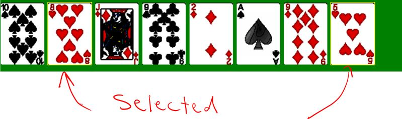

Card Games 1.0 by Bardia Parmoun

Released on: 30/05/2019

______________________________________________________________________________________

DESCRIPTION
______________________________________________________________________________________
This program is simulating two popular games of blackjack and crazy eights. 
If you want to test black jack game run the "black_jack.t" file and if you want to
run the crazy eights game run the "crazy_eights.t" file

If you do not know how to play blackjack checkout this link:
https://bicyclecards.com/how-to-play/blackjack/

If you do not know how to play crazy eights checkout this link:
https://bicyclecards.com/how-to-play/crazy-eights/

INSTALLING UNDER WINDOWS 10
______________________________________________________________________________________
This program was created with the Turing language. All you need to run this game is 
to install the turing language:

You can install turing using this link:
https://turing.software.informer.com/4.1/
______________________________________________________________________________________
 
USAGE
______________________________________________________________________________________
Playing blackjack:
When you run the program, click p to start playing and then place your bet.

After that you are offered your cards and can hit h for hit and s for stand

The computer will then play the dealer's hand and you will have the chance to play 
again and place a new bet 

Playing blackjack:
When you run the program, click p to start.

In each round you can select the cards that you want to play

  

After that select the "select" button and the then computer will play its turn.

  

The first person to get rid of all of their cards wins the game
______________________________________________________________________________________

CREDITS
______________________________________________________________________________________
Author: Bardia Parmoun

______________________________________________________________________________________

LICENSE
______________________________________________________________________________________
MIT License

Copyright (c) [2019] [Bardia Parmoun]

Permission is hereby granted, free of charge, to any person obtaining a copy
of this software and associated documentation files (the "Software"), to deal
in the Software without restriction, including without limitation the rights
to use, copy, modify, merge, publish, distribute, sublicense, and/or sell
copies of the Software, and to permit persons to whom the Software is
furnished to do so, subject to the following conditions:

The above copyright notice and this permission notice shall be included in all
copies or substantial portions of the Software.

THE SOFTWARE IS PROVIDED "AS IS", WITHOUT WARRANTY OF ANY KIND, EXPRESS OR
IMPLIED, INCLUDING BUT NOT LIMITED TO THE WARRANTIES OF MERCHANTABILITY,
FITNESS FOR A PARTICULAR PURPOSE AND NONINFRINGEMENT. IN NO EVENT SHALL THE
AUTHORS OR COPYRIGHT HOLDERS BE LIABLE FOR ANY CLAIM, DAMAGES OR OTHER
LIABILITY, WHETHER IN AN ACTION OF CONTRACT, TORT OR OTHERWISE, ARISING FROM,
OUT OF OR IN CONNECTION WITH THE SOFTWARE OR THE USE OR OTHER DEALINGS IN THE
SOFTWARE.